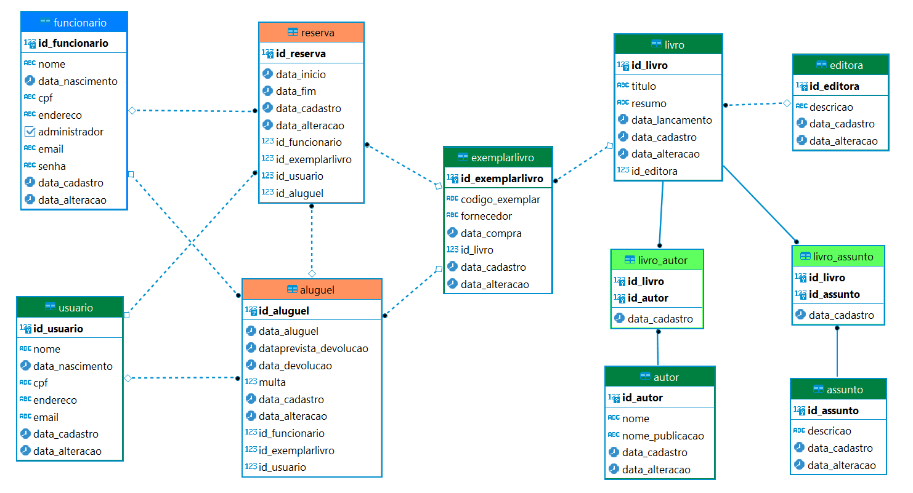
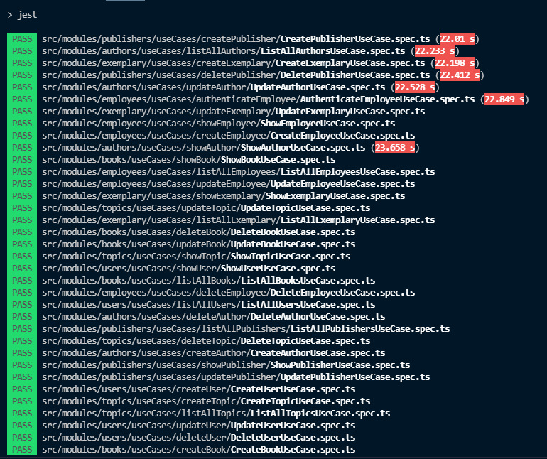
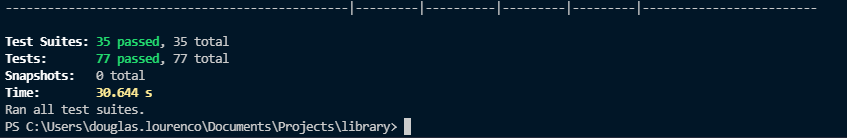
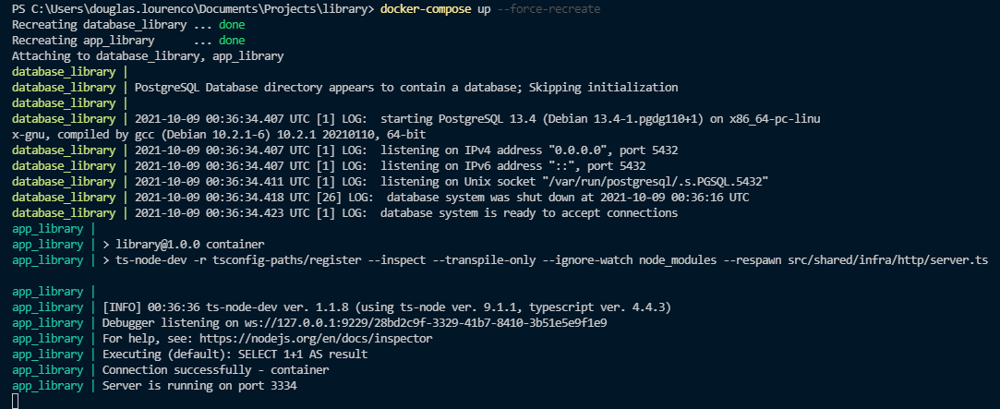

<h2>Library API</h2>
 
<h4>Project in progress...</h4>
 

<h3>Technologies</h3>
<ul>
    <li>Express</li>
    <li>Bcrypt</li>
    <li>Express Async Erros</li>
    <li>Json Web Token</li>
    <li>Moment js</li>
    <li>Postgres</li>
    <li>Docker</li>
    <li>Sequelize</li>
    <li>Tsyringe</li>
    <li>Jest</li>
</ul>
 

 
<h3>About</h3>
<ul>
    <li>Node</li>
    <li>Typescript</li>
    <li>Clean Code</li>
    <li>Oriented Object Programming</li>
    <li>SOLID principles</li>
    <li>TDD</li>
</ul>
 

 

    <h3>Database Diagram</h3>
        
    

    <h3>Tests</h3>
    
    
    

    <h3>Container Docker</h3>
    

